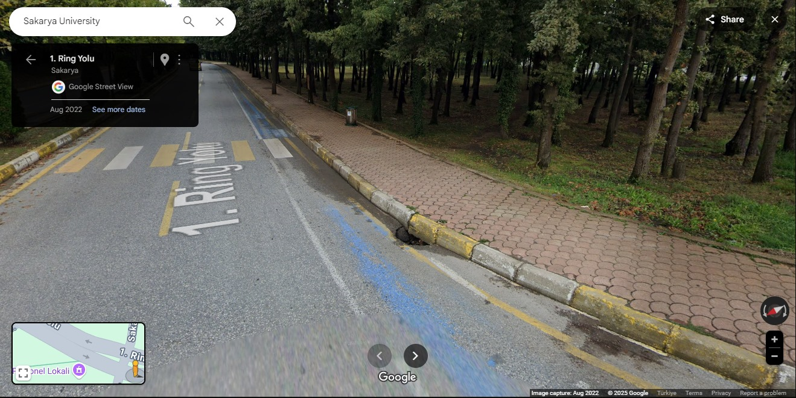
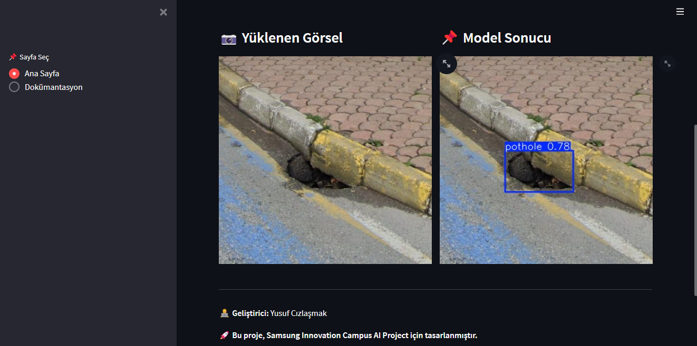
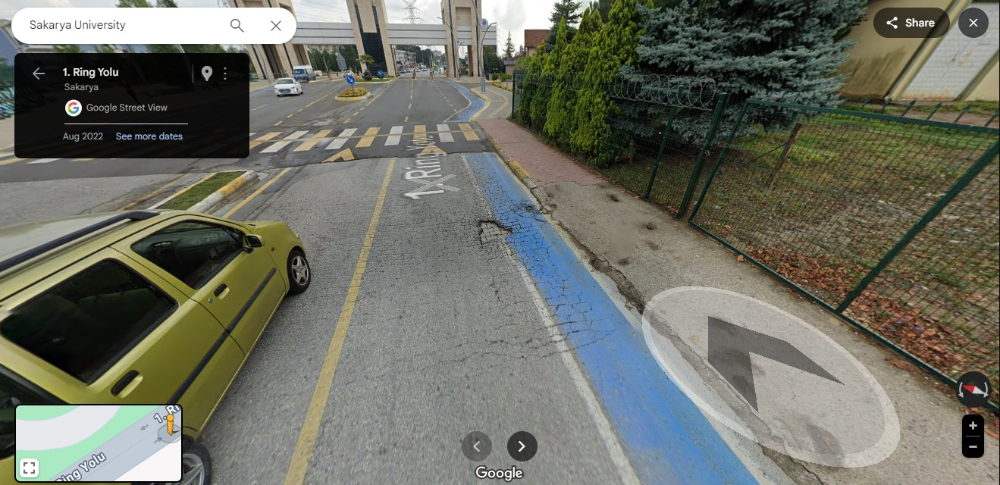
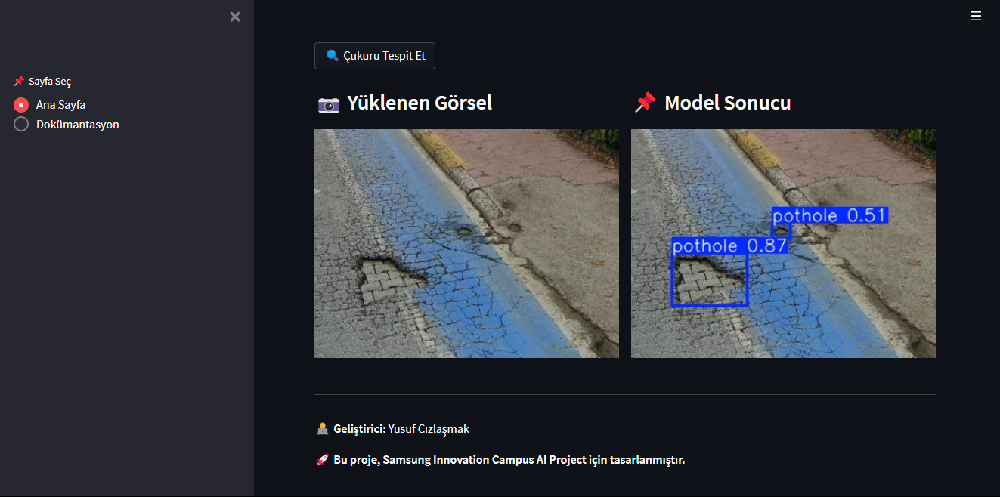
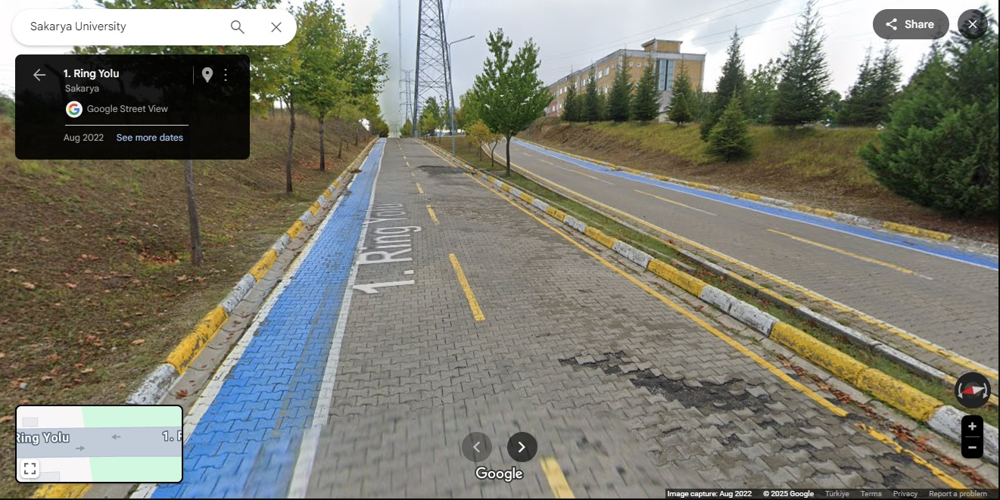
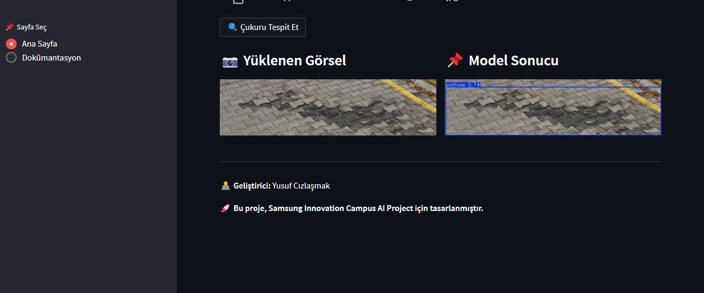
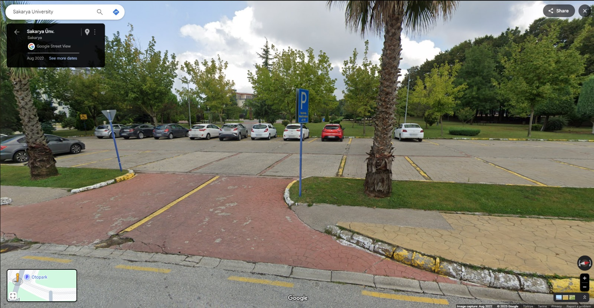
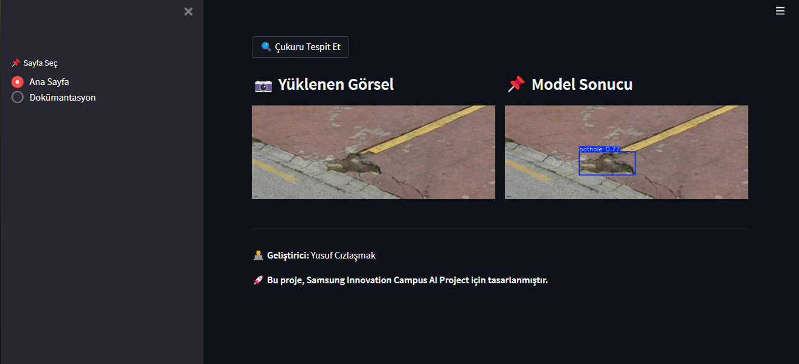

# yusuf-cizlasmak


* ## Hedefler: 

- Roboflow'dan toplanan dummy modeller ile başlangıç için model eğitimi ✅

- DuckDuckGo, Flickr, Bing, Yahoo API kullanarak resimleri Çukur 
Görüntülerini indirme ✅

- İndirilen görüntülerin;
    
    * Embeddings'lerini çıkartma ✅
    * PCA ile Boyut azaltımı sağlama ✅
    * Azaltılan PCA boyutları ile K-Means algoritmalarıyla kümeleme yapılması ✅
    * Kümeleme yapılan görüntülerin hızlı bir şekilde ayrılıştırması ve ayrıştırılan görüntülerin modelin tahminine tabii  tutulup, göremediklerinin etiketlenip tekrardan eğitilmesi( ACTIVATE LEARNING) ✅

    * Her eğitilen modellerin belirli bir val. setiyle karşılaştırılması* (Gerçek veri seti)   ✅


    Yeni güncelleme: 06/02

    * ModelCard ✅

    * Modeller eğitildi, artık deploy edilmeye hazır gözüküyor. Gradio  ❌  Streamlit ✅  ile arayüz tasarlanıp 


    * Ardından Dockerize edilebilir. ✅


    ## Uygulamayı çalıştırmak için:

    

    ```bash
    docker compose up -d 
    ```

    veya
    
    ```bash
    streamlit run app.py
    ```

    ardından localhost:8501 adresine giderek uygulamayı kullanabilirsiniz.

    ## Uygulamadan bazı görüntüler:
    ### Örnek 1:
    
    
    
    
    ### Örnek 2:
    
    
    
    

    ### Örnek 3:

    

    

    ### Örnek 4:

    

    


* **Daha fazla bilgi için ilgili kodu çalıştırdıktan sonra Dökümantasyon sayfasına bakabilirsiniz**.